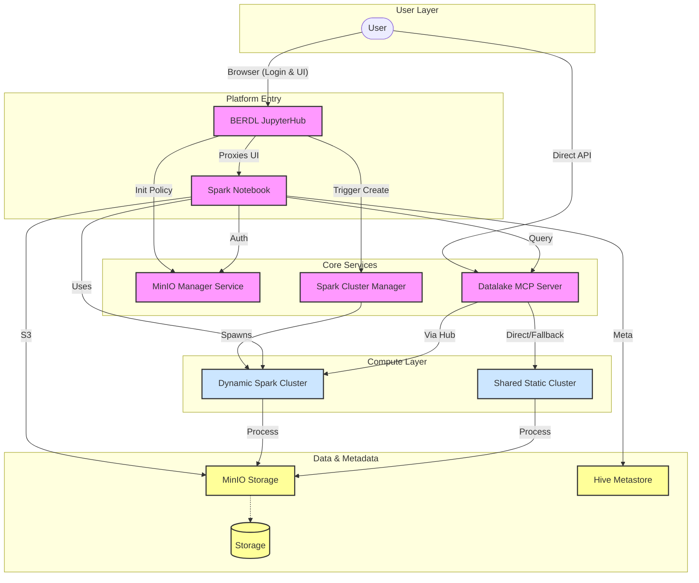
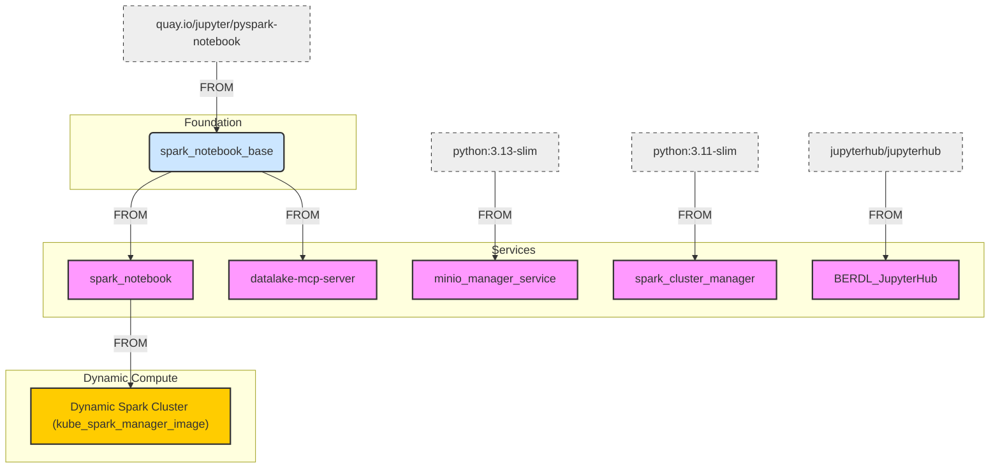
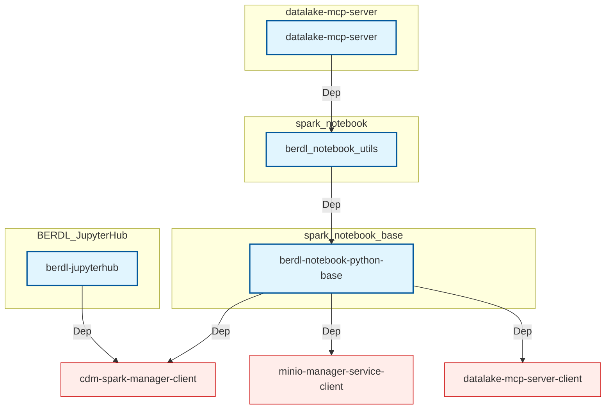

# BERDL System Documentation

This directory contains documentation for the BERDL purpose-built data lakehouse system.

All source code repositories are located in the [BERDataLakehouse GitHub Organization](https://github.com/BERDataLakehouse).

## System Architecture

BERDL utilizes a microservices architecture to provide a secure, scalable, and interactive data analysis environment. The core components include dynamic notebook spawning, secure credential management, and an MCP (Model Context Protocol) server for AI-assisted data operations.

## Container Dependency Architecture

The following diagram illustrates the build hierarchy and base image dependencies for the BERDL services.

## Python Dependency Architecture

The following diagram illustrates the internal Python package dependencies.

## Core Components

| Service | Description | Documentation | Repository |
|---------|-------------|---------------|------------|
| **JupyterHub** | Manages user sessions and spawns individual notebook servers. | [BERDL JupyterHub](./services/berdl-jupyterhub.md) | [Repo](https://github.com/BERDataLakehouse/BERDL_JupyterHub) |
| **Spark Notebook** | User's personal workspace with Spark pre-configured. | [Spark Notebook](./services/spark_notebook.md) | [Repo](https://github.com/BERDataLakehouse/spark_notebook) |
| **Spark Notebook Base** | Foundational Docker image with PySpark and common dependencies. | [Spark Notebook Base](./services/spark_notebook_base.md) | [Repo](https://github.com/BERDataLakehouse/spark_notebook_base) |
| **Datalake MCP Server** | FastAPI Data API with MCP layer for AI interactions and direct queries. | [Datalake MCP Service](./services/datalake-mcp-service.md) | [Repo](https://github.com/BERDataLakehouse/datalake-mcp-server) |
| **MinIO Manager Service** | Handles dynamic credentials and IAM policies for secure data access. | [MinIO Manager Service](./services/minio-manager-service.md) | [Repo](https://github.com/BERDataLakehouse/minio_manager_service) |
| **Spark Cluster Manager** | API for managing dynamic, personal Spark clusters on K8s (Primary for Users). | [Spark Cluster Manager](./services/spark-cluster-manager.md) | [Repo](https://github.com/BERDataLakehouse/spark_cluster_manager) |
| **Hive Metastore** | Stores metadata for Delta Lake tables. | [Hive Metastore](./services/hive-metastore.md) | [Repo](https://github.com/BERDataLakehouse/hive_metastore) |
| **Spark Cluster** | Spark master/worker image for static and dynamic clusters. | [Spark Cluster](./services/spark-cluster.md) | [Repo](https://github.com/BERDataLakehouse/kube_spark_manager_image) |
