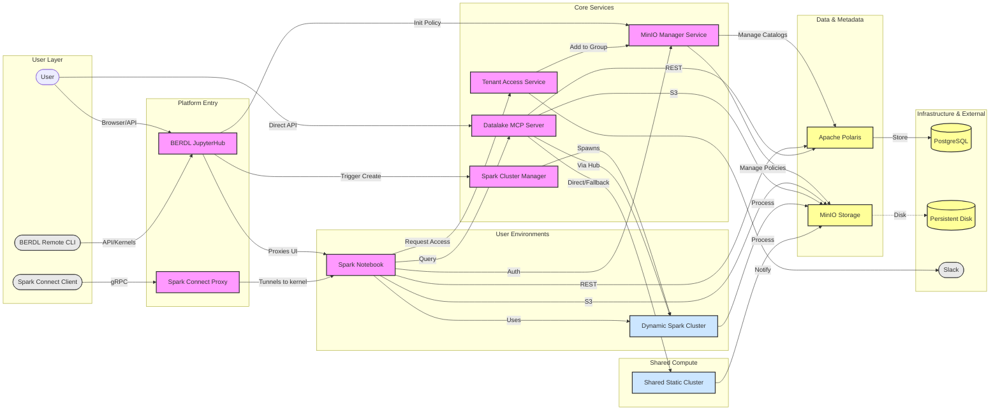
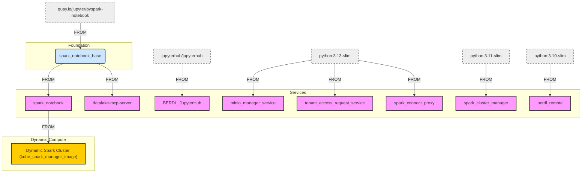
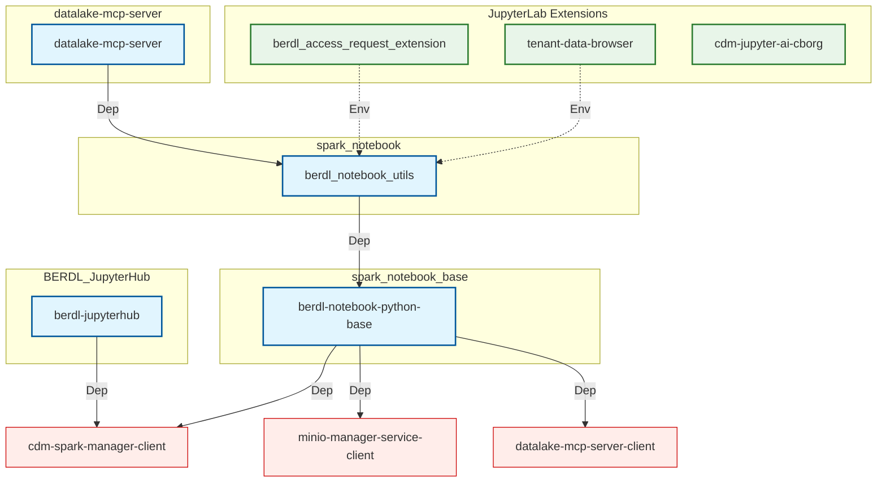

# BERDL System Documentation

This directory contains documentation for the BERDL purpose-built data lakehouse system.

All source code repositories are located in the [BERDataLakehouse GitHub Organization](https://github.com/BERDataLakehouse).

> **Note**: This documentation provides a brief introduction to each core component of the BERDL system. For detailed development and service information, please refer to each repository's README file.

## Authentication

All BERDL services require **KBase authentication** using a KBase Token. Users must have the **`BERDL_USER`** role assigned to their KBase account to access the platform. Admin operations additionally require the **`CDM_JUPYTERHUB_ADMIN`** role.

## System Architecture

BERDL utilizes a microservices architecture to provide a secure, scalable, and interactive data analysis environment. The core components include dynamic notebook spawning, secure credential management, and an MCP (Model Context Protocol) server for AI-assisted data operations.

```mermaid
graph LR
    subgraph Users ["User Layer"]
        direction TB
        User([User])
        Remote([BERDL Remote CLI])
        SPXClient([Spark Connect Client])
    end

    subgraph Entry ["Platform Entry"]
        direction TB
        JH[BERDL JupyterHub]
        SPX[Spark Connect Proxy]
    end

    subgraph Workspaces ["User Environments"]
        direction TB
        NB[Spark Notebook]
        DYNC[Dynamic Spark Cluster]
    end

    subgraph Core ["Core Services"]
        direction TB
        MMS[MinIO Manager Service]
        SCM[Spark Cluster Manager]
        MCP[Datalake MCP Server]
        TAS[Tenant Access Service]
    end

    subgraph Compute ["Shared Compute"]
        direction TB
        SM[Shared Static Cluster]
    end

    subgraph Data ["Data & Metadata"]
        direction TB
        POL[Apache Polaris]
        S3[MinIO Storage]
    end

    subgraph Infra ["Infrastructure & External"]
        direction TB
        PG[(PostgreSQL)]
        Disk[(Persistent Disk)]
        Slack([Slack])
    end

    %% User Entry Flow
    User -->|"Browser/API"| JH
    User -->|"Direct API"| MCP
    Remote -->|"API/Kernels"| JH
    SPXClient -->|"gRPC"| SPX
    
    %% Entry Routing
    JH -->|"Proxies UI"| NB
    JH -->|"Init Policy"| MMS
    JH -->|"Trigger Create"| SCM
    SPX -->|"Tunnels to kernel"| NB
    
    %% Workspace Interactions
    NB -->|"Uses"| DYNC
    NB -->|"Auth"| MMS
    NB -->|"Query"| MCP
    NB -->|"Request Access"| TAS
    
    %% Core Services Logic
    SCM -->|"Spawns"| DYNC
    TAS -->|"Notify"| Slack
    TAS -->|"Add to Group"| MMS
    MCP -->|"Direct/Fallback"| SM
    MCP -->|"Via Hub"| DYNC
    MMS -->|"Manage Catalogs"| POL
    MMS -->|"Manage Policies"| S3
    
    %% Data Access
    NB -->|"S3"| S3
    NB -->|"REST"| POL
    MCP -->|"S3"| S3
    MCP -->|"REST"| POL
    DYNC -->|"Process"| S3
    SM -->|"Process"| S3
    
    %% Infrastructure Backends
    POL -->|"Store"| PG
    S3 -.->|"Disk"| Disk

    %% Styling
    classDef service fill:#f9f,stroke:#333,stroke-width:2px;
    classDef storage fill:#ff9,stroke:#333,stroke-width:2px;
    classDef compute fill:#cce6ff,stroke:#333,stroke-width:2px;
    classDef external fill:#e8e8e8,stroke:#333,stroke-width:1px;
    
    class JH,NB,MMS,SCM,MCP,TAS,SPX service;
    class S3,POL,PG,Disk storage;
    class DYNC,SM compute;
    class Slack,Remote,SPXClient external;
```

## Container Dependency Architecture

The following diagram illustrates the build hierarchy and base image dependencies for the BERDL services.

```mermaid
graph TD
    %% Base Images
    JQ[quay.io/jupyter/pyspark-notebook]
    PUB_JH[jupyterhub/jupyterhub]
    PY313[python:3.13-slim]
    PY311[python:3.11-slim]
    PY310[python:3.10-slim]

    %% Internal Base
    subgraph Foundation
        id1(spark_notebook_base)
    end

    %% Services
    subgraph Services
        NB[spark_notebook]
        MCP[datalake-mcp-server]
        MMS[minio_manager_service]
        SCM[spark_cluster_manager]
        JH[BERDL_JupyterHub]
        TAS[tenant_access_request_service]
        BRM[berdl_remote]
        SPX[spark_connect_proxy]
    end

    %% Dynamic Compute
    subgraph DynamicCompute ["Dynamic Compute"]
        DYNC["Dynamic Spark Cluster (kube_spark_manager_image)"]
    end

    %% Relations
    JQ -->|FROM| id1
    
    id1 -->|FROM| NB
    id1 -->|FROM| MCP
    
    NB -->|FROM| DYNC
    
    PUB_JH -->|FROM| JH
    PY313 -->|FROM| MMS
    PY313 -->|FROM| TAS
    PY313 -->|FROM| SPX
    PY311 -->|FROM| SCM
    PY310 -->|FROM| BRM
    
    %% Styling
    classDef external fill:#eee,stroke:#333,stroke-dasharray: 5 5;
    classDef internal fill:#cce6ff,stroke:#333,stroke-width:2px;
    classDef service fill:#f9f,stroke:#333,stroke-width:2px;
    classDef compute fill:#ffcc00,stroke:#333,stroke-width:2px;

    class JQ,PUB_JH,PY313,PY311,PY310 external;
    class id1 internal;
    class NB,MCP,MMS,SCM,JH,TAS,BRM,SPX service;
    class DYNC compute;
```

## Python Dependency Architecture

The following diagram illustrates the internal Python package dependencies.

```mermaid
graph TD
    %% Clients
    SMC[cdm-spark-manager-client]
    MMSC[minio-manager-service-client]
    MCPC[datalake-mcp-server-client]
    
    %% Base Package
    subgraph Base ["spark_notebook_base"]
        PNB[berdl-notebook-python-base]
    end
    
    %% Service Implementations
    subgraph NotebookUtils ["spark_notebook"]
        NU[berdl_notebook_utils]
    end
    
    subgraph Extensions ["JupyterLab Extensions"]
        ARE[berdl_access_request_extension]
        TDB[tenant-data-browser]
        CBA[cdm-jupyter-ai-cborg]
    end
    
    subgraph MCPServer ["datalake-mcp-server"]
        MCP[datalake-mcp-server]
    end
    
    subgraph JupyterHub ["BERDL_JupyterHub"]
        JH[berdl-jupyterhub]
    end

    %% Dependencies
    PNB -->|Dep| SMC
    PNB -->|Dep| MMSC
    PNB -->|Dep| MCPC
    
    NU -->|Dep| PNB
    MCP -->|Dep| NU
    
    JH -->|Dep| SMC
    
    %% JupyterLab extensions depend on user environment
    ARE -.->|Env| NU
    TDB -.->|Env| NU
    
    %% Styling
    classDef client fill:#ffedea,stroke:#cc0000,stroke-width:1px;
    classDef pkg fill:#e1f5fe,stroke:#01579b,stroke-width:2px;
    classDef ext fill:#e8f5e9,stroke:#2e7d32,stroke-width:2px;
    
    class SMC,MMSC,MCPC client;
    class PNB,NU,MCP,JH pkg;
    class ARE,TDB,CBA ext;
```

## Core Components

| Service | Description | Documentation | Repository |
|---------|-------------|---------------|------------|
| **JupyterHub** | Manages user sessions and spawns individual notebook servers. | [BERDL JupyterHub](./services/berdl-jupyterhub.md) | [Repo](https://github.com/BERDataLakehouse/BERDL_JupyterHub) |
| **Spark Notebook** | User's personal workspace with Spark pre-configured. | [Spark Notebook](./services/spark_notebook.md) | [Repo](https://github.com/BERDataLakehouse/spark_notebook) |
| **Spark Notebook Base** | Foundational Docker image with PySpark and common dependencies. | [Spark Notebook Base](./services/spark_notebook_base.md) | [Repo](https://github.com/BERDataLakehouse/spark_notebook_base) |
| **Datalake MCP Server** | FastAPI Data API with MCP layer for AI interactions and direct queries. | [Datalake MCP Service](./services/datalake-mcp-service.md) | [Repo](https://github.com/BERDataLakehouse/datalake-mcp-server) |
| **Datalake MCP Server Client** | Auto-generated Python client for the MCP server. | [Datalake MCP Server Client](./services/datalake-mcp-server-client.md) | [Repo](https://github.com/BERDataLakehouse/datalake-mcp-server-client) |
| **MinIO Manager Service** | Handles dynamic credentials and IAM policies for secure data access. | [MinIO Manager Service](./services/minio-manager-service.md) | [Repo](https://github.com/BERDataLakehouse/minio_manager_service) |
| **MinIO Manager Service Client** | Auto-generated Python client for the MinIO Manager Service. | [MinIO Manager Service Client](./services/minio_manager_service_client.md) | [Repo](https://github.com/BERDataLakehouse/minio_manager_service_client) |
| **Spark Cluster Manager** | API for managing dynamic, personal Spark clusters on K8s (Primary for Users). | [Spark Cluster Manager](./services/spark-cluster-manager.md) | [Repo](https://github.com/BERDataLakehouse/spark_cluster_manager) |
| **Hive Metastore** | Stores metadata for Delta Lake tables. | [Hive Metastore](./services/hive-metastore.md) | [Repo](https://github.com/BERDataLakehouse/hive_metastore) |
| **Spark Cluster** | Spark master/worker image for static and dynamic clusters. | [Spark Cluster](./services/spark-cluster.md) | [Repo](https://github.com/BERDataLakehouse/kube_spark_manager_image) |
| **BERDL Access Request Extension** | JupyterLab extension providing UI for tenant access requests. | [Access Request Extension](./services/berdl-access-request-extension.md) | [Repo](https://github.com/BERDataLakehouse/berdl_access_request_extension) |
| **Tenant Data Browser** | JupyterLab extension for navigating MinIO object storage visually. | [Tenant Data Browser](./services/tenant-data-browser.md) | [Repo](https://github.com/BERDataLakehouse/tenant-data-browser) |
| **CDM Jupyter AI CBorg** | Integration module between Jupyter AI and the CBorg LLM API provider. | [Jupyter AI CBorg Setup](./services/cdm-jupyter-ai-cborg.md) | [Repo](https://github.com/BERDataLakehouse/cdm-jupyter-ai-cborg) |
| **Tenant Access Request Service** | Slack workflow for users to request access to tenant groups. | [Tenant Access Request Service](./services/tenant-access-request-service.md) | [Repo](https://github.com/BERDataLakehouse/tenant_access_request_service) |
| **Spark Connect Proxy** | Multi-user authenticating layer for Spark Connect requests. | [Spark Connect Proxy](./services/spark_connect_proxy.md) | [Repo](https://github.com/BERDataLakehouse/spark_connect_proxy) |
| **Spark Connect Remote Client** | Python library that interfaces with Spark Connect Proxy. | [Spark Connect Remote Client](./services/spark_connect_remote.md) | [Repo](https://github.com/BERDataLakehouse/spark_connect_remote) |
| **BERDL Remote CLI** | Local development toolkit for connecting to BERDL securely. | [BERDL Remote CLI](./services/berdl-remote.md) | [Repo](https://github.com/BERDataLakehouse/berdl_remote) |
