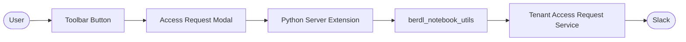

# BERDL Access Request Extension

> JupyterLab extension providing a UI for tenant access requests.

| | |
|---|---|
| **Docker Image** | Bundled with [spark_notebook_base](./spark_notebook_base.md) |
| **GitHub Repo** | [berdl_access_request_extension](https://github.com/BERDataLakehouse/berdl_access_request_extension) |

## Overview

The BERDL Access Request Extension is a JupyterLab extension that adds a "Request Tenant Access" button to notebook toolbars. It provides a user-friendly modal for requesting access to tenant groups without needing to write Python code.

## Key Features

- **Toolbar Button**: One-click access to the request form from any notebook.
- **Modal Dialog**: Clean UI for selecting groups and permission levels.
- **Backend Integration**: Uses `berdl_notebook_utils` to communicate with the Tenant Access Request Service.

## Architecture



## User Workflow

1. **Click** the "Request Tenant Access" button in the notebook toolbar.
2. **Select** a tenant group from the available groups list.
3. **Choose** permission level (Read-Only or Read-Write).
4. **Optionally** provide a justification.
5. **Submit** the request.

The request is sent to the Tenant Access Request Service, which posts to Slack for admin approval.

## Technical Details

| Component | Description |
|-----------|-------------|
| **Frontend** | TypeScript/React extension for JupyterLab 4.x |
| **Backend** | Python server extension using `jupyter_server` |
| **API Endpoints** | `/api/access-request/groups`, `/api/access-request/submit` |

## API Endpoints

### GET /api/access-request/groups

Returns available groups and user's current group memberships.

```json
{
  "available_groups": ["kbase", "research", "shared-data"],
  "my_groups": ["default", "kbasero"]
}
```

### POST /api/access-request/submit

Submits a tenant access request.

**Request:**
```json
{
  "tenant_name": "kbase",
  "permission": "read_only",
  "justification": "Need access for analysis"
}
```

**Response:**
```json
{
  "status": "pending",
  "message": "Access request submitted. Awaiting admin approval.",
  "tenant_name": "kbase",
  "permission": "read_only"
}
```

## Related Services

- [Tenant Access Request Service](./tenant-access-request-service.md) - Backend service handling Slack approvals
- [Spark Notebook](./spark_notebook.md) - Where the extension runs
- [spark_notebook_base](./spark_notebook_base.md) - Includes the extension as a dependency
