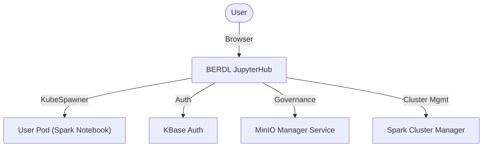

# BERDL JupyterHub

> The user entry point that spawns personal Spark Notebook environments on Kubernetes.

| | |
|---|---|
| **Docker Image** | `ghcr.io/berdatalakehouse/berdl_jupyterhub:main` |
| **GitHub Repo** | [BERDL_JupyterHub](https://github.com/BERDataLakehouse/BERDL_JupyterHub) |

## Overview

A deployment of JupyterHub specifically configured for Kubernetes. It allows users to spawn personal `spark_notebook` containers. It integrates with KBase for authentication and the MinIO Manager Service for data governance.

## Key Features

- **KubeSpawner**: Spawns user environments as Kubernetes pods.
- **Profiles**: Users can select "Small", "Medium", or "Large" resource profiles.
- **Idle Culling**: Automatically stops idle servers to save resources.
- **Integration**:
    - **MinIO Manager Service**: Calls this service to **initialize user policies and groups** and fetch credentials.
    - **Spark Cluster Manager**: Automatically calls this service to **start a dynamic spark cluster** for each user upon login.

## Architecture

