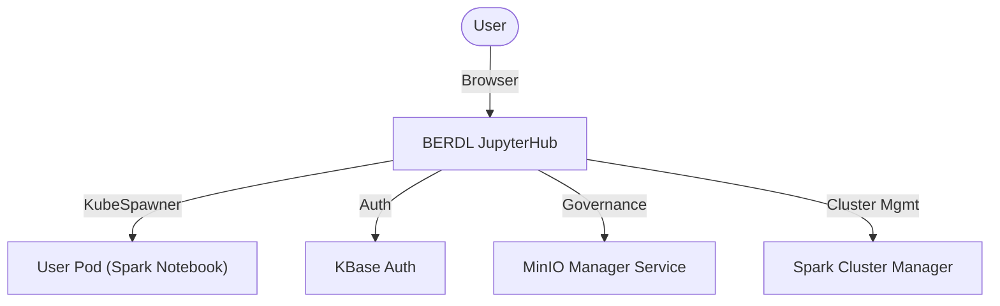

# BERDL JupyterHub

> The user entry point that spawns personal Spark Notebook environments on Kubernetes.

| | |
|---|---|
| **Docker Image** | `ghcr.io/berdatalakehouse/berdl_jupyterhub:main` |
| **GitHub Repo** | [BERDL_JupyterHub](https://github.com/BERDataLakehouse/BERDL_JupyterHub) |

## Overview

A deployment of JupyterHub specifically configured for Kubernetes. It allows users to spawn personal `spark_notebook` containers directly as isolated pods. It integrates tightly with KBase Auth2 for authentication, the MinIO Manager Service for data lake governance, and the Spark Cluster Manager for dynamic compute allocation.

## Key Features

- **KubeSpawner**: Spawns user environments as Kubernetes pods.
- **Profiles**: Users can select "Medium" or "Large" resource profiles.
- **Idle Culling**: Automatically stops idle servers to save resources and compute.
- **Integration**:
    - **MinIO Manager Service**: Calls this service on login to **initialize user policies and groups** and fetch temporary secure MinIO credentials.
    - **Spark Cluster Manager**: Automatically calls this service to **start a dynamic spark cluster** for each user upon login.

## Architecture

```mermaid
graph TD
    User([User]) -->|Browser| JH[BERDL JupyterHub]
    JH -->|KubeSpawner| Pod["User Pod (Spark Notebook)"]
    JH -->|Auth| KBase[KBase Auth]
    JH -->|Governance| MMS[MinIO Manager Service]
    JH -->|Cluster Mgmt| SCM[Spark Cluster Manager]
```
