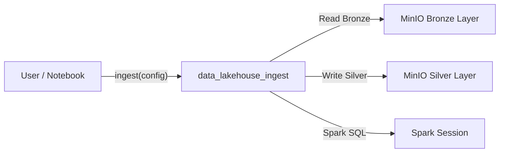

# Data Lakehouse Ingest

> Config-driven PySpark ingestion framework for loading data into the BER Data Lakehouse.

| | |
|---|---|
| **GitHub Repo** | [data-lakehouse-ingest](https://github.com/kbase/data-lakehouse-ingest) |
| **Python** | 3.13 |
| **Package Manager** | uv |

## Overview

`data_lakehouse_ingest` is an end-to-end ingestion framework for loading data into the BER Data Lakehouse using PySpark and MinIO. It reads source datasets from MinIO (Bronze layer), applies optional schema-based casting using SQL-style schema definitions, and writes curated Delta tables to the Silver layer.

The package is pre-installed in the [Spark Notebook](./spark_notebook.md) and auto-imported as `ingest` in the IPython startup environment.

## Key Features

- **Config-Driven**: JSON configuration defines tenant, dataset, paths, schemas, and table definitions. Configs can be loaded inline or from MinIO.
- **Multi-Format Support**: CSV, TSV, JSON, XML, and Parquet input formats.
- **Schema Casting**: SQL-style schema definitions (`schema_sql`) for type enforcement.
- **Delta Lake Output**: Writes curated tables to the Silver layer with optional partitioning.
- **LinkML Validation**: Integrates LinkML for schema validation.
- **Logging**: Contextual logging with pipeline, schema, and table metadata.

## Architecture



## Usage

```python
from data_lakehouse_ingest import ingest

# Load config from MinIO path or inline JSON
cfg_path = "s3a://cdm-lake/tenant-general-warehouse/kbase/datasets/.../config.json"

report = ingest(cfg_path)
print(report)
```

## Internal Components

| Module | Description |
|--------|-------------|
| `core.py` | Main `ingest()` entry point |
| `config_loader.py` | JSON config parsing (inline or from MinIO) |
| `loaders/` | Format-specific readers (DSV, JSON, XML, Parquet) |
| `orchestrator/` | Schema parsing, table processing, batch orchestration |
| `logger.py` | Contextual logging |

## Dependencies

- `boto3` / `minio` — S3/MinIO access
- `linkml` / `linkml-runtime` / `linkml-validator` — Schema validation
- `berdl-notebook-utils` — Spark session and notebook utilities

## Related Services

- [Spark Notebook](./spark_notebook.md) — Where the package runs (auto-imported as `ingest`)
- [MinIO Manager Service](./minio-manager-service.md) — Manages access to Bronze/Silver storage
