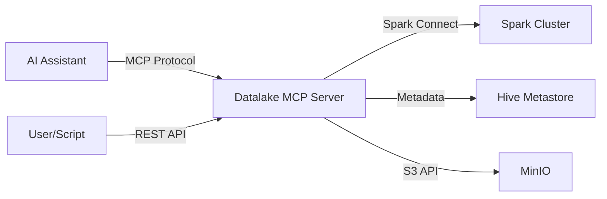

# Datalake MCP Server

> A FastAPI Data API with an MCP layer, enabling both direct programmatic access and AI-driven natural language queries to Delta Lake.

| | |
|---|---|
| **Docker Image** | `ghcr.io/berdatalakehouse/datalake-mcp-server:main` |
| **GitHub Repo** | [datalake-mcp-server](https://github.com/BERDataLakehouse/datalake-mcp-server) |

## Overview

The Datalake MCP (Model Context Protocol) Server is a dual-purpose service:
1.  **Data API**: A standard FastAPI-based application providing REST endpoints for querying and interacting with Delta Lake data.
2.  **MCP Interface**: A wrapper layer that exposes these capabilities to AI assistants via the Model Context Protocol, enabling natural language interactions.

This design ensures that while AI agents can drive operations, users and other systems can also interact with the data lake directly via standard API calls.

## Key Features

- **Natural Language to SQL**: Translates user prompts into Spark SQL queries.
- **Direct Data API**: Exposes standard REST endpoints (FastAPI) for direct programmatic access to data, independent of the MCP layer.
- **Dual Cluster Mode**:
    - **Dynamic**: When accessed via proper auth context (JupyterHub), uses the user's personal dynamic cluster.
    - **Static**: When accessed directly or without user context, falls back to the static shared cluster.
- **Delta Lake Integration**: Reads directly from Delta tables in MinIO.

## Architecture

## Integrations

- **Spark Connect**: Connects to user's dynamic cluster or falls back to shared static cluster.
- **Hive Metastore**: `thrift://hive-metastore:9083` - Table metadata.
- **MinIO**: `http://minio:9002` - Underlying S3 storage.
