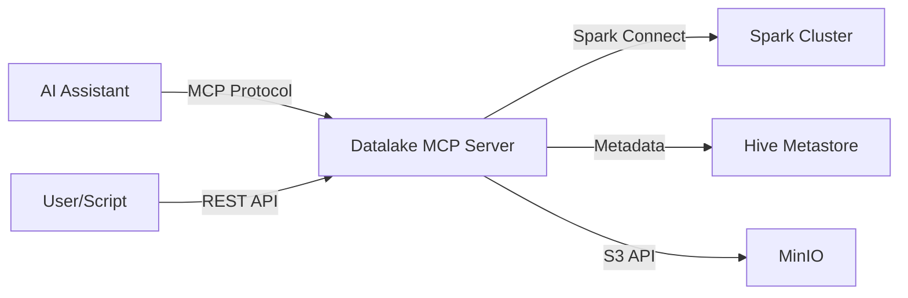

# Datalake MCP Server

> A FastAPI Data API with an MCP layer, enabling both direct programmatic access and AI-driven natural language queries to Delta Lake.

| | |
|---|---|
| **Docker Image** | `ghcr.io/berdatalakehouse/datalake-mcp-server:main` |
| **GitHub Repo** | [datalake-mcp-server](https://github.com/BERDataLakehouse/datalake-mcp-server) |
| **Python** | 3.13 |
| **Framework** | FastAPI 0.135 / Uvicorn / MCP 1.26 |
| **Package Manager** | uv |

## Overview

The Datalake MCP (Model Context Protocol) Server is a dual-purpose service:
1.  **Data API**: A standard FastAPI-based application providing REST endpoints for querying and interacting with Delta Lake data.
2.  **MCP Interface**: A wrapper layer that exposes these capabilities to AI assistants via the Model Context Protocol, enabling natural language interactions.

This design ensures that while AI agents can drive operations, users and other systems can also interact with the data lake directly via standard API calls.

## Key Features

- **Natural Language to SQL**: Translates user prompts into Spark SQL queries.
- **Direct Data API**: Exposes standard REST endpoints (FastAPI) for direct programmatic access to data, independent of the MCP layer.
- **Multi-Engine Query Support**:
    - **Spark Connect**: Default engine — connects to user's dynamic Spark cluster or shared static cluster.
    - **Trino**: Lightweight HTTP-based engine for fast, concurrent queries. Set via `QUERY_ENGINE=trino` or per-request `engine` field.
- **Delta Lake Integration**: Reads directly from Delta tables in MinIO.

## Architecture

```mermaid
graph LR
    AI[AI Assistant] -->|MCP Protocol| DS[Datalake MCP Server]
    User[User/Script] -->|REST API| DS
    DS -->|Spark Connect| SP[Spark Cluster]
    DS -->|Metadata| HM[Hive Metastore]
    DS -->|S3 API| IO[MinIO]
```

## API Endpoints

### Delta Lake Operations (`/delta/*`)
| Method | Endpoint | Description |
|--------|----------|-------------|
| POST | `/delta/databases/list` | List all databases in the Hive metastore. Supports namespace filtering. |
| POST | `/delta/databases/tables/list` | List all tables in a specific database. |
| POST | `/delta/databases/tables/schema` | Get the schema (columns) of a specific table. |
| POST | `/delta/databases/structure` | Get the complete structure of all databases with optional schemas. |
| POST | `/delta/tables/count` | Get row count for a Delta table. |
| POST | `/delta/tables/sample` | Retrieve a sample of rows from a Delta table. |
| POST | `/delta/tables/query` | Execute a raw SQL query against a Delta table (Deprecated, use async endpoint). |
| POST | `/delta/tables/select` | Execute a structured SELECT query with JOINs, aggregations, pagination. |

### Async Query Operations (`/delta/tables/query/async/*`)
| Method | Endpoint | Description |
|--------|----------|-------------|
| POST | `/delta/tables/query/async/submit` | Submit a long-running Spark SQL query for background execution. |
| GET | `/delta/tables/query/async/{job_id}/status` | Check the completion status of an async query. |
| GET | `/delta/tables/query/async/{job_id}/results` | Retrieve the results of a completed async query. |
| GET | `/delta/tables/query/async/jobs` | List all active or recent query jobs for the current user. |

### Health (`/health`)
| Method | Endpoint | Description |
|--------|----------|-------------|
| GET | `/health` | Deep health check for Redis, Hive Metastore, and other backend services. |

### MCP Interface (`/mcp`)
| Method | Endpoint | Description |
|--------|----------|-------------|
| * | `/mcp` | MCP protocol endpoint. All `/delta/*` endpoints are exposed as MCP tools. |

## Integrations

- **Spark Connect**: Connects to user's dynamic cluster or falls back to shared static cluster.
- **Trino**: Alternative query engine via DB-API HTTP connections. Per-request or global selection.
- **Hive Metastore**: `thrift://hive-metastore:9083` - Table metadata.
- **MinIO**: `http://minio:9002` - Underlying S3 storage.
- **Redis**: Caching layer for improved performance.
