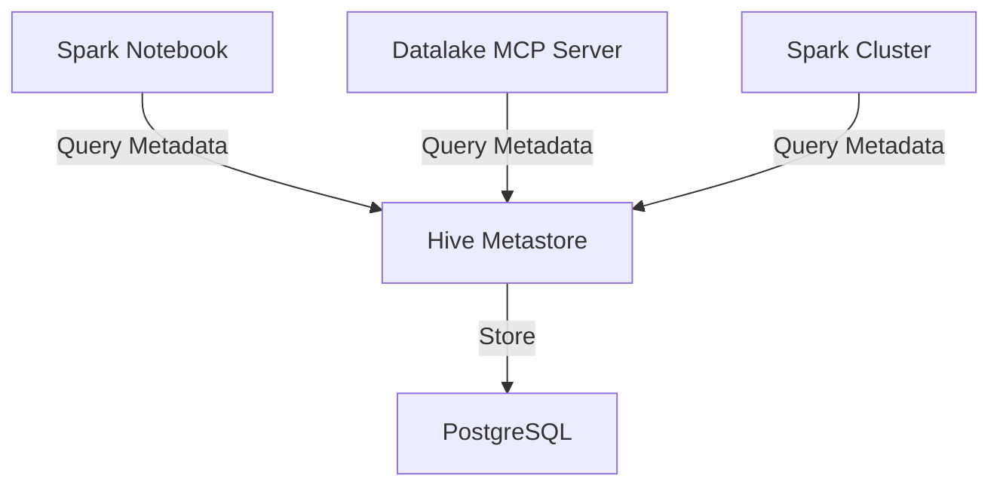

# Hive Metastore

> The central metadata catalog for all Delta Lake tables.

| | |
|---|---|
| **Docker Image** | `ghcr.io/berdatalakehouse/hive_metastore:main` |
| **GitHub Repo** | [hive_metastore](https://github.com/BERDataLakehouse/hive_metastore) |

## Overview

The Hive Metastore serves as the central catalog for all tables in the Delta Lake. It stores the metadata (schema, partition info, location) that allows Spark to locate data in MinIO.

## Key Features

- **Schema Registry**: Stores table schemas and partition metadata.
- **Delta Lake Integration**: Works with Delta tables stored in MinIO.
- **Shared Service**: Used by all Spark-based services in the platform.

## Architecture

## Integrations

- **PostgreSQL**: Backend database for metadata storage.
- **MinIO Warehouses**:
  - `s3a://cdm-lake/users-sql-warehouse/` - User personal SQL warehouses
  - `s3a://cdm-lake/tenants-sql-warehouse/` - Tenant/group SQL warehouses
- **Used By**: `spark_notebook`, `datalake-mcp-server`, Spark clusters.
