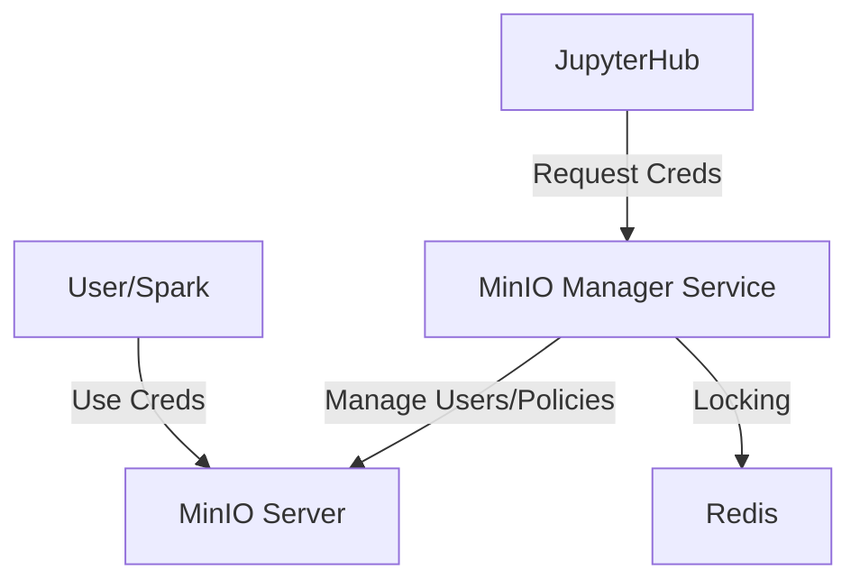

# MinIO Manager Service

> The central governance authority for MinIO, managing dynamic credentials and IAM policies.

| | |
|---|---|
| **Docker Image** | `ghcr.io/berdatalakehouse/minio_manager_service:main` |
| **GitHub Repo** | [minio_manager_service](https://github.com/BERDataLakehouse/minio_manager_service) |

## Overview

The MinIO Manager Service is the central governance authority for the BERDL platform. It manages MinIO users, groups, and IAM policies dynamically, ensuring secure and isolated access to data.

## Key Features

- **Dynamic Credentials**: Issues short-lived MinIO credentials for users and Spark sessions.
- **Policy Enforcement**: Automatically updates IAM policies based on group membership and sharing settings.
- **JupyterHub Integration**: Triggered by JupyterHub to **initialize user policies** and fetch credentials for spawned pods.
- **Data Sharing**: Manages path-level access controls for sharing data between users and groups.

## Architecture

## API Endpoints

### Credentials (JupyterHub Integration)
| Method | Endpoint | Description |
|--------|----------|-------------|
| GET | `/credentials/` | Returns fresh S3 access/secret keys for the authenticated user. Auto-creates user if needed. |

### Sharing (User-facing)
| Method | Endpoint | Description |
|--------|----------|-------------|
| POST | `/sharing/share` | Share an S3 path with specified users and/or groups. |
| POST | `/sharing/unshare` | Remove sharing permissions from users/groups. |
| POST | `/sharing/make-public` | Make a path publicly accessible to all users. |
| POST | `/sharing/make-private` | Remove a path from all shared access (owner only). |
| POST | `/sharing/get_path_access_info` | Get users/groups that have access to a path. |

### Workspaces
| Method | Endpoint | Description |
|--------|----------|-------------|
| GET | `/workspaces/*` | Various endpoints for listing user workspaces and files. |

### Management (Admin-only)
| Method | Endpoint | Description |
|--------|----------|-------------|
| GET | `/management/users` | List all users (paginated). |
| POST | `/management/users/{username}` | Create a new user. |
| POST | `/management/users/{username}/rotate-credentials` | Force credential rotation. |
| DELETE | `/management/users/{username}` | Delete a user. |
| GET | `/management/groups` | List all groups. |
| POST | `/management/groups/{group_name}` | Create a new group. |
| POST | `/management/groups/{group_name}/members/{username}` | Add user to group. |
| DELETE | `/management/groups/{group_name}/members/{username}` | Remove user from group. |
| DELETE | `/management/groups/{group_name}` | Delete a group. |
| GET | `/management/policies` | List all policies (paginated). |
| DELETE | `/management/policies/{policy_name}` | Delete a policy. |
