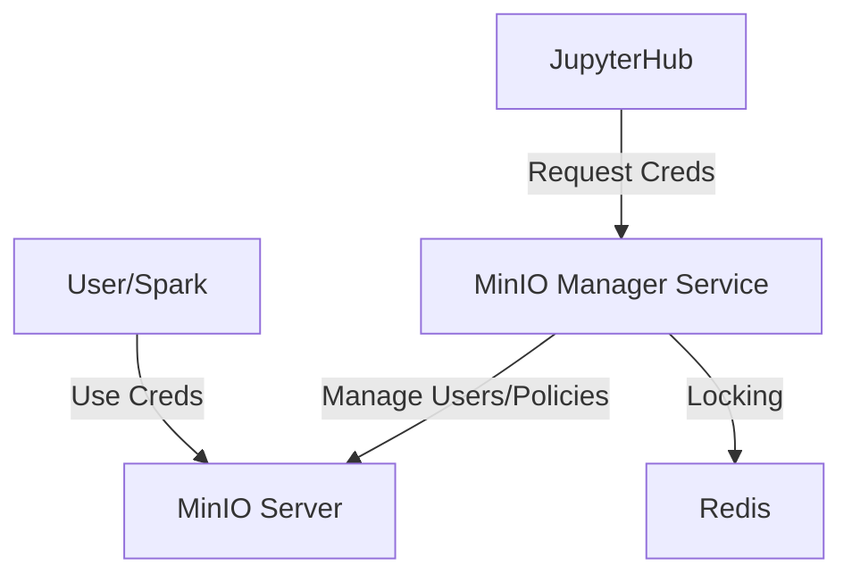

# MinIO Manager Service

> The central governance authority for MinIO, managing dynamic credentials and IAM policies.

| | |
|---|---|
| **Docker Image** | `ghcr.io/berdatalakehouse/minio_manager_service:main` |
| **GitHub Repo** | [minio_manager_service](https://github.com/BERDataLakehouse/minio_manager_service) |

## Overview

The MinIO Manager Service is the central governance authority for the BERDL platform. It manages MinIO users, groups, and IAM policies dynamically, ensuring secure and isolated access to data.

## Key Features

- **Dynamic Credentials**: Issues short-lived MinIO credentials for users and Spark sessions.
- **Policy Enforcement**: Automatically updates IAM policies based on group membership and sharing settings.
- **JupyterHub Integration**: Triggered by JupyterHub to **initialize user policies** and fetch credentials for spawned pods.
- **Data Sharing**: Manages path-level access controls for sharing data between users and groups.

## Architecture

## API Endpoints

- **GET /credentials/**: Returns valid S3 access/secret keys for the authenticated user.
- **POST /groups/**: Manage user groups.
- **POST /share/**: Share paths with other users/groups.
