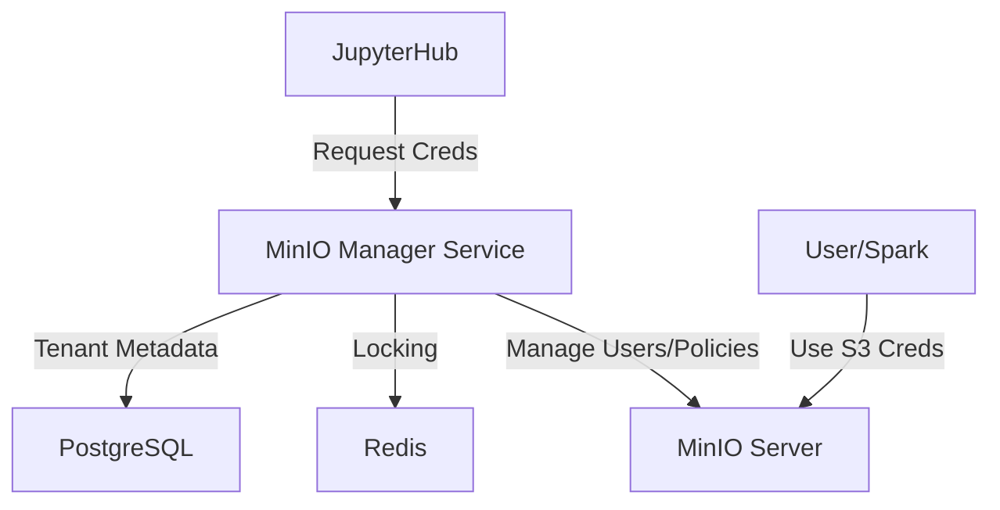

# MinIO Manager Service

> The central governance authority for MinIO, managing dynamic credentials and IAM policies.

| | |
|---|---|
| **Docker Image** | `ghcr.io/berdatalakehouse/minio_manager_service:main` |
| **GitHub Repo** | [minio_manager_service](https://github.com/BERDataLakehouse/minio_manager_service) |
| **Python** | 3.13 |
| **Framework** | FastAPI 0.135 / Uvicorn |
| **Package Manager** | uv |

## Overview

The MinIO Manager Service is the central governance authority for the BERDL platform. It programmatically provisions MinIO S3 storage policies, providing dynamic credential management and unified access control for Spark applications.

## Key Features

- **Dynamic Credentials**: Issues short-lived MinIO credentials for users and Spark sessions, with explicit credential rotation.
- **Policy Enforcement**: Automatically updates IAM policies based on group membership.
- **JupyterHub Integration**: Triggered by JupyterHub upon login to initialize user policies and fetch credentials for spawned pods.
- **Dataset Isolation**: Provisions isolated S3 workspaces per user (`user_{username}`) and per tenant (`tenant_{groupname}`).
- **Tenant Management**: Full tenant lifecycle with metadata, steward assignments, and member management.
- **Data Sharing**: Manages path-level access controls for sharing data securely.
- **Database Migrations**: Uses Alembic for PostgreSQL schema migrations.

## Architecture

```mermaid
graph TD
    JH[JupyterHub] -->|Request Creds| MMS[MinIO Manager Service]
    MMS -->|Manage Users/Policies| MIN[MinIO Server]
    MMS -->|Locking| REDIS[Redis]
    MMS -->|Tenant Metadata| PG[PostgreSQL]

    User[User/Spark] -->|Use S3 Creds| MIN
```

## API Endpoints

### Credentials
| Method | Endpoint | Description |
|--------|----------|-------------|
| GET | `/credentials/` | Returns cached MinIO credentials for the authenticated user. Auto-creates user if needed. |
| POST | `/credentials/rotate` | Explicitly rotate MinIO credentials for the authenticated user. |

### Workspaces (User-facing)
| Method | Endpoint | Description |
|--------|----------|-------------|
| GET | `/workspaces/me` | Get workspace info for the authenticated user. |
| GET | `/workspaces/me/groups` | List groups the user belongs to. |
| GET | `/workspaces/me/policies` | Get full policy details for the user. |
| GET | `/workspaces/me/accessible-paths` | Get all S3 paths accessible to the user. |
| GET | `/workspaces/me/groups/{group_name}` | Get workspace info for a specific group. |
| GET | `/workspaces/me/groups/{group_name}/sql-warehouse-prefix` | Get SQL warehouse prefix for a group. |
| GET | `/workspaces/me/sql-warehouse-prefix` | Get SQL warehouse prefix for the user. |
| GET | `/workspaces/me/namespace-prefix` | Get the governance namespace prefix. |

### Tenants
| Method | Endpoint | Description |
|--------|----------|-------------|
| GET | `/tenants` | List all tenants with summary info. |
| GET | `/tenants/{tenant_name}` | Get full tenant detail (metadata, members, stewards). |
| PATCH | `/tenants/{tenant_name}` | Update tenant metadata (steward or admin). |
| POST | `/tenants/{tenant_name}` | Create tenant metadata (admin only, idempotent). |
| DELETE | `/tenants/{tenant_name}` | Delete tenant metadata (admin only). |
| GET | `/tenants/{tenant_name}/members` | List tenant members. |
| POST | `/tenants/{tenant_name}/members/{username}` | Add tenant member. |
| DELETE | `/tenants/{tenant_name}/members/{username}` | Remove tenant member. |
| GET | `/tenants/{tenant_name}/stewards` | List tenant stewards. |
| POST | `/tenants/{tenant_name}/stewards/{username}` | Assign steward (admin only). |
| DELETE | `/tenants/{tenant_name}/stewards/{username}` | Remove steward (admin only). |

### Sharing (User-facing)
| Method | Endpoint | Description |
|--------|----------|-------------|
| POST | `/sharing/share` | **(DEPRECATED)** Share an S3 path. Use Tenant Workspaces instead. |
| POST | `/sharing/unshare` | **(DEPRECATED)** Remove sharing permissions. Use Tenant Workspaces instead. |
| POST | `/sharing/make-public` | **(DEPRECATED)** Make a path publicly accessible. Use `globalusers` namespace instead. |
| POST | `/sharing/make-private` | **(DEPRECATED)** Remove a path from all shared access. Use `globalusers` namespace instead. |
| POST | `/sharing/get_path_access_info` | Get users/groups that have access to a path. |

### Management (Admin-only)
| Method | Endpoint | Description |
|--------|----------|-------------|
| GET | `/management/users` | List all users (paginated). |
| GET | `/management/users/names` | List all usernames (lightweight). |
| POST | `/management/users/{username}` | Create a new user with home directories. |
| POST | `/management/users/{username}/rotate-credentials` | Force credential rotation. |
| DELETE | `/management/users/{username}` | Delete a user and cleanup resources. |
| GET | `/management/groups` | List all groups with membership info. |
| GET | `/management/groups/names` | List available group names. |
| POST | `/management/groups/{group_name}` | Create a new group with shared workspace. |
| POST | `/management/groups/{group_name}/members/{username}` | Add user to group. |
| DELETE | `/management/groups/{group_name}/members/{username}` | Remove user from group. |
| DELETE | `/management/groups/{group_name}` | Delete a group and cleanup resources. |
| GET | `/management/policies` | List all policies (paginated). |
| DELETE | `/management/policies/{policy_name}` | Delete a policy. |
| POST | `/management/migrate/regenerate-policies` | Force-regenerate all IAM policies from current template. |
