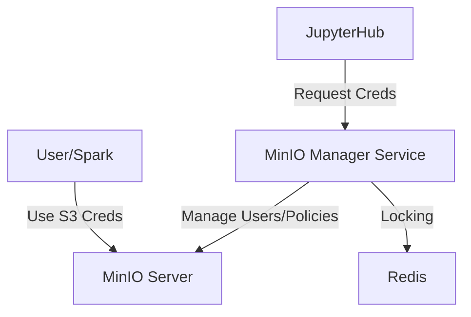

# MinIO Manager Service

> The central governance authority for MinIO, managing dynamic credentials and IAM policies.

| | |
|---|---|
| **Docker Image** | `ghcr.io/berdatalakehouse/minio_manager_service:main` |
| **GitHub Repo** | [minio_manager_service](https://github.com/BERDataLakehouse/minio_manager_service) |

## Overview

The MinIO Manager Service is the central governance authority for the BERDL platform. It programmatically provisions MinIO S3 storage policies, providing dynamic credential management and unified access control for Spark applications.

## Key Features

- **Dynamic Credentials**: Issues short-lived MinIO credentials for users and Spark sessions.
- **Policy Enforcement**: Automatically updates IAM policies based on group membership.
- **JupyterHub Integration**: Triggered by JupyterHub upon login to initialize user policies and fetch credentials for spawned pods.
- **Dataset Isolation**: Provisions isolated S3 workspaces per user (`user_{username}`) and per tenant (`tenant_{groupname}`).
- **Data Sharing**: Manages path-level access controls for sharing data securely.

## Architecture

```mermaid
graph TD
    JH[JupyterHub] -->|Request Creds| MMS[MinIO Manager Service]
    MMS -->|Manage Users/Policies| MIN[MinIO Server]
    MMS -->|Locking| REDIS[Redis]

    User[User/Spark] -->|Use S3 Creds| MIN
```

## API Endpoints

### Credentials (JupyterHub Integration)
| Method | Endpoint | Description |
|--------|----------|-------------|
| GET | `/credentials/` | Returns fresh S3 access/secret keys for the authenticated user. Auto-creates user if needed. |

### Sharing (User-facing)
| Method | Endpoint | Description |
|--------|----------|-------------|
| POST | `/sharing/share` | **(DEPRECATED)** Share an S3 path with specified users and/or groups. Use Tenant Workspaces instead. |
| POST | `/sharing/unshare` | **(DEPRECATED)** Remove sharing permissions from users/groups. Use Tenant Workspaces instead. |
| POST | `/sharing/make-public` | **(DEPRECATED)** Make a path publicly accessible to all users. Use `globalusers` namespace instead. |
| POST | `/sharing/make-private` | **(DEPRECATED)** Remove a path from all shared access (owner only). Use `globalusers` namespace instead. |
| POST | `/sharing/get_path_access_info` | Get users/groups that have access to a path. |

### Workspaces
| Method | Endpoint | Description |
|--------|----------|-------------|
| GET | `/workspaces/*` | Various endpoints for listing user workspaces and files. |

### Management (Admin-only)
| Method | Endpoint | Description |
|--------|----------|-------------|
| GET | `/management/users` | List all users (paginated). |
| POST | `/management/users/{username}` | Create a new user. |
| POST | `/management/users/{username}/rotate-credentials` | Force credential rotation. |
| DELETE | `/management/users/{username}` | Delete a user. |
| GET | `/management/groups` | List all groups. |
| POST | `/management/groups/{group_name}` | Create a new group. |
| POST | `/management/groups/{group_name}/members/{username}` | Add user to group. |
| DELETE | `/management/groups/{group_name}/members/{username}` | Remove user from group. |
| DELETE | `/management/groups/{group_name}` | Delete a group. |
| GET | `/management/policies` | List all policies (paginated). |
| DELETE | `/management/policies/{policy_name}` | Delete a policy. |
