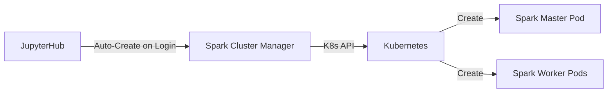

# Spark Cluster Manager

> A REST API that dynamically creates and manages user-dedicated Spark clusters on Kubernetes.

| | |
|---|---|
| **Docker Image** | `ghcr.io/berdatalakehouse/spark_cluster_manager:main` |
| **GitHub Repo** | [spark_cluster_manager](https://github.com/BERDataLakehouse/spark_cluster_manager) |

## Overview

A REST API service that manages **dedicated (dynamic) Spark clusters** for users within Kubernetes.

> **Role**: This is the **primary** way for users to run distributed Spark jobs. Instead of sharing the static cluster, users spawn their own isolated clusters to ensure resource guarantees and isolation.

> **Note**: This is distinct from the shared "Spark Cluster" documented [here](./spark-cluster.md), which is a single static cluster. The Spark Cluster Manager allows *dynamic* creation of personal clusters.

## Key Features

- **Dynamic Clusters**: Users can create/delete their own Spark clusters via API.
- **REST API**: `POST /clusters`, `GET /clusters`, `DELETE /clusters`.
- **Auth**: Secured via KBase authentication.

## Architecture

