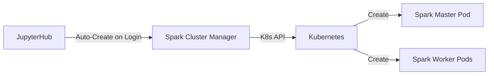

# Spark Cluster Manager

> A REST API that dynamically creates and manages user-dedicated Spark clusters on Kubernetes.

| | |
|---|---|
| **Docker Image** | `ghcr.io/berdatalakehouse/spark_cluster_manager:main` |
| **GitHub Repo** | [spark_cluster_manager](https://github.com/BERDataLakehouse/spark_cluster_manager) |
| **Python** | 3.12 |
| **Framework** | FastAPI 0.135 / Uvicorn |
| **Package Manager** | uv |

## Overview

A REST API service that manages **dedicated (dynamic) Spark clusters** for users within Kubernetes. This service acts as an abstraction layer between user actions and the underlying Kubernetes API.

> **Role**: This is the **primary** way for users to run distributed Spark jobs. Instead of sharing a static cluster, users spawn their own isolated clusters to ensure guaranteed compute resources and strict data isolation.

> **Note**: This architecture separates the *management* of the cluster (done by this API) from the *container image* running the cluster (the `kube_spark_manager_image` repository).

## Key Features

- **Dynamic Provisioning**: Creates and tears down dedicated Spark Master and Worker pods per user.
- **REST API**: Simple JSON endpoints for cluster lifecycle management.
- **KBase Auth**: Secured via KBase authentication tokens.
- **Configurable Resources**: Default worker cores, memory, and count are configurable via environment variables.
- **Automatic Cleanup**: Ensures resources are reaped when clusters are deleted.

## API Endpoints

| Method | Endpoint | Description |
|--------|----------|-------------|
| GET | `/health` | Check the health status of the service |
| POST | `/clusters` | Creates a new Spark cluster for the authenticated user |
| GET | `/clusters` | Get the status/connection details of an existing user cluster |
| DELETE | `/clusters` | Deletes the Spark cluster belonging to the authenticated user |

## Architecture

```mermaid
graph LR
    JH[JupyterHub] -->|Auto-Create on Login| SCM[Spark Cluster Manager]
    SCM -->|K8s API| K8s[Kubernetes]
    K8s -->|Create| SM[Spark Master Pod]
    K8s -->|Create| SW[Spark Worker Pods]
```
