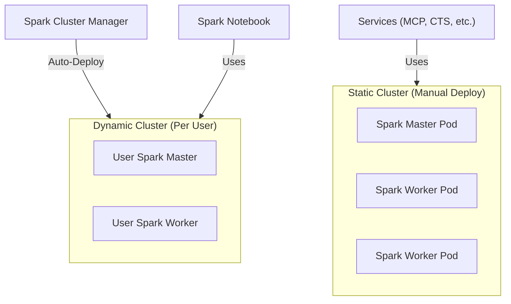

# Spark Cluster (Static & Dynamic)

> The Docker image used for all Spark clusters, supporting both master and worker modes.

| | |
|---|---|
| **Docker Image** | `ghcr.io/berdatalakehouse/kube_spark_manager_image:main` |
| **GitHub Repo** | [kube_spark_manager_image](https://github.com/BERDataLakehouse/kube_spark_manager_image) |
| **Base Image** | [spark_notebook](./spark_notebook.md) |

## Overview

This image is used to run Spark clusters in Kubernetes. It supports two deployment modes:

1.  **Static Cluster**: Manually deployed to K8s for shared/fallback use (e.g., by the Datalake MCP Server).
2.  **Dynamic Cluster**: Automatically deployed per-user by the [Spark Cluster Manager](./spark-cluster-manager.md) upon JupyterHub login.

Both modes use the same image, configured via the `SPARK_MODE` environment variable.

## Key Features

- **Dual Mode Support**: Runs as either `master` or `worker` based on `SPARK_MODE` env var.
- **Inherited Environment**: Built on `spark_notebook`, inheriting all Python dependencies and Spark configurations.
- **K8s Native**: Designed for Kubernetes deployment with proper entrypoint scripts.

## Architecture

## Configuration

The container runs in one of two modes based on `SPARK_MODE`:

| Mode | Description | Required Env Vars |
|------|-------------|-------------------|
| `master` | Starts Spark Master daemon | None (uses Spark defaults) |
| `worker` | Starts Spark Worker daemon | `SPARK_MASTER_URL` (e.g., `spark://master:7077`) |

## Static Cluster Deployment

The static cluster is manually deployed to the `prod` namespace:
- **Service**: `sharedsparkclustermaster`
- **Port 7077**: Spark Master URL
- **Port 8090**: Web UI

> **Role**: Serves as a **fallback** for the MCP Server when no user-specific dynamic cluster is available.

## Dynamic Cluster Deployment

Dynamic clusters are created automatically by the [Spark Cluster Manager](./spark-cluster-manager.md):
- Triggered when a user logs into JupyterHub
- Creates dedicated master + worker pods for the user
- Provides resource isolation and guaranteed compute

## Relationship to Notebooks

Notebooks connect to either:
- Their **dynamic cluster** (primary) for isolated, guaranteed resources
- The **static cluster** (fallback) when accessed directly without JupyterHub context
