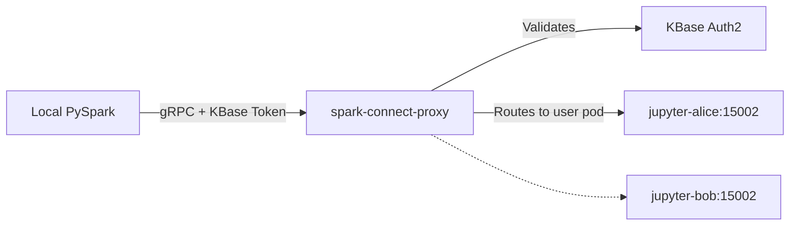

# Spark Connect Proxy

| | |
|---|---|
| **Docker Image** | `ghcr.io/berdatalakehouse/spark_connect_proxy:main` |
| **GitHub Repo** | [spark_connect_proxy](https://github.com/BERDataLakehouse/spark_connect_proxy) |
| **Python** | 3.13 |
| **Package Manager** | uv |

The `spark-connect-proxy` service acts as a centralized, multi-user ingress gateway for routing external PySpark connections securely into individual user environments on BERDL JupyterHub.

## Overview

Spark Connect enables remote execution of DataFrame operations via gRPC. However, since each BERDL user runs their own isolated Spark session in their personal Kubernetes pod, exposing every user's pod directly would be unmanageable.

`spark-connect-proxy` solves this by providing a single static endpoint (e.g., `spark.berdl.kbase.us:443`). When a user connects to this endpoint using their local Spark Connect client, they pass their KBase Auth token in the request metadata. 

## Architecture & Routing

1. **Client Request:** A user runs PySpark locally configured to connect to the central proxy, passing their KBase token in the gRPC headers (as `x-kbase-token`).
2. **Authentication:** The proxy validates the token against the KBase Auth2 service and resolves the associated `username`.
3. **Dynamic Routing:** The proxy dynamically constructs the internal Kubernetes DNS address for that specific user's JupyterHub notebook pod (e.g., `jupyter-{username}.jupyterhub-prod.svc.cluster.local:15002`).
4. **Proxy Forwarding:** The gRPC stream is forwarded transparently backing and forth between the user's local machine and their personal Spark kernel on the Hub.

## Security Mechanism

- **Header Validation:** The proxy strictly requires a valid KBase token on every connection metadata request.
- **Cache:** Token resolutions are cached for a short duration (`TOKEN_CACHE_TTL`) to minimize Auth2 load during intense dataframe operations.
- The proxy strictly routes only to the pod belonging to the resolved username, preventing cross-tenant Spark access.
