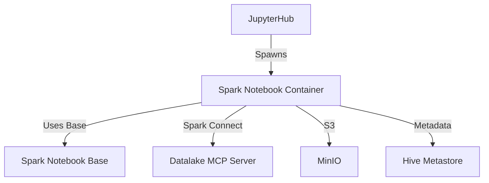

# Spark Notebook

> The user's personal JupyterLab workspace, pre-configured with Spark and data lake access.

| | |
|---|---|
| **Docker Image** | `ghcr.io/berdatalakehouse/spark_notebook:main` |
| **GitHub Repo** | [spark_notebook](https://github.com/BERDataLakehouse/spark_notebook) |
| **Base Image** | [spark_notebook_base](./spark_notebook_base.md) |

## Overview

The Spark Notebook is the primary user interface for the BERDL platform. It provides a JupyterLab environment pre-configured with Spark, Python, and the necessary libraries to interact with the data lake.

## Key Features

- **JupyterLab**: Full-featured notebook environment.
- **Pre-configured Spark**: Ready-to-use Spark session with credentials auto-injected.
- **AI Integration**: Includes `jupyter-ai` for AI-assisted coding.
- **Tenant Access UI**: Built-in [Access Request Extension](./berdl-access-request-extension.md) for requesting data access.

## Lifecycle

1. **Spawning**: When a user logs into JupyterHub, a dedicated container is spawned via KubeSpawner.
2. **Cluster Creation**: JupyterHub triggers the Spark Cluster Manager to create a dynamic Spark cluster for the user.
3. **Credential Injection**: JupyterHub calls the MinIO Manager Service to initialize user policies and inject S3 credentials.
4. **Initialization**:
    - `entrypoint.sh` sets up user permissions and environment.
    - `setup_spark_session.py` (via `notebook_utils`) initializes Spark with the injected credentials.
5. **Ready**: User can now run Spark jobs against their personal dynamic cluster with access to their data in MinIO.

## Architecture

## Internal Components

- **`notebook_utils`**: Python package for Spark session management.
- **`configs/`**: Spark defaults, Jupyter extensions, and hooks.
