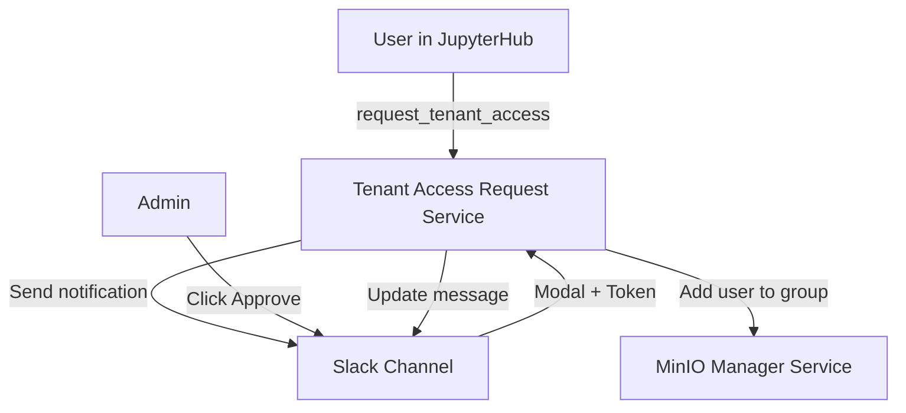

# Tenant Access Request Service

> Self-service Slack workflow for users to request access to tenant groups.

| | |
|---|---|
| **Docker Image** | `ghcr.io/berdatalakehouse/tenant_access_request_service:main` |
| **GitHub Repo** | [tenant_access_request_service](https://github.com/BERDataLakehouse/tenant_access_request_service) |

## Overview

The Tenant Access Request Service provides a self-service workflow for users to request access to tenant groups (data sharing groups) in BERDL. Requests are sent to a Slack channel where administrators can approve or deny them with a single click.

## Key Features

- **Self-Service Requests**: Users request tenant access directly from JupyterHub notebooks.
- **Slack Integration**: Approval requests appear in Slack with Approve/Deny buttons.
- **One-Click Approval**: Admins approve via a Slack modal where they provide their KBase token.
- **No Stored Tokens**: Admin tokens are used once and never stored—secure by design.
- **Automatic Provisioning**: Approved requests automatically add users to MinIO groups.

## Architecture



## API Endpoints

### Access Requests (User-facing)
| Method | Endpoint | Description |
|--------|----------|-------------|
| POST | `/requests/` | Submit a tenant access request. Sends notification to Slack. |

### Approvals (Admin-facing)
| Method | Endpoint | Description |
|--------|----------|-------------|
| POST | `/approvals/approve` | Approve a pending request (requires admin token). |
| POST | `/approvals/deny` | Deny a pending request. |

### Slack Integration
| Method | Endpoint | Description |
|--------|----------|-------------|
| POST | `/slack/interact` | Handles Slack button clicks and modal submissions. |

### Health
| Method | Endpoint | Description |
|--------|----------|-------------|
| GET | `/health` | Health check endpoint. |

## User Workflow

Users can request access via the **toolbar button** (recommended) or **Python commands**.

### Option 1: Toolbar Button (Recommended)

1. **Click** the "Request Tenant Access" button in the notebook toolbar.
2. **Select** a tenant group, permission level, and provide justification.
3. **Submit** the request.

See [BERDL Access Request Extension](./berdl-access-request-extension.md) for details.

### Option 2: Python Commands

1. **User requests access** from a notebook:
   ```python
   request_tenant_access(
       tenant_name="kbase",
       permission="read_only",
       justification="Need access for data analysis"
   )
   ```

2. **Slack notification** appears for admin review:
   ```
   🔔 Access Request
   User: alice
   Tenant: kbase
   Permission: read_only
   Justification: Need access for data analysis
   [Approve] [Deny]
   ```

3. **Admin clicks Approve** → Modal prompts for KBase token → User is added to group.

4. **User verifies access**:
   ```python
   get_my_groups()  # Should now include 'kbasero'
   ```

## Configuration

| Environment Variable | Description |
|---------------------|-------------|
| `SLACK_BOT_TOKEN` | Slack Bot OAuth token (xoxb-...) |
| `SLACK_SIGNING_SECRET` | Slack app signing secret for request verification |
| `SLACK_CHANNEL_ID` | Channel ID to post approval requests |
| `GOVERNANCE_API_URL` | URL of the MinIO Manager Service |
| `KBASE_AUTH_URL` | KBase authentication service URL |

## Related Services

- [MinIO Manager Service](./minio-manager-service.md) - Manages group membership
- [JupyterHub](./berdl-jupyterhub.md) - Where users run notebooks
- [spark_notebook](./spark_notebook.md) - Provides `request_tenant_access()` function
